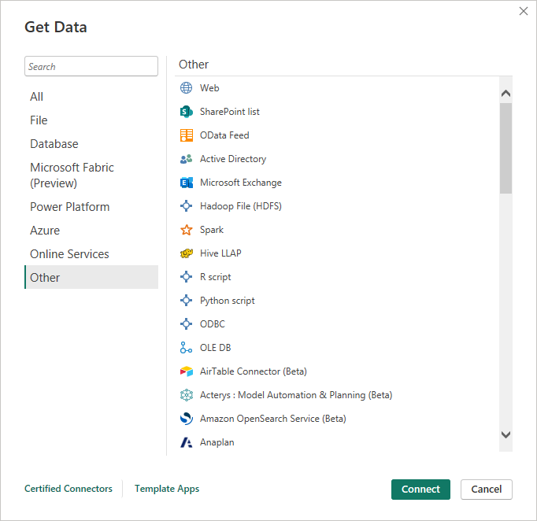
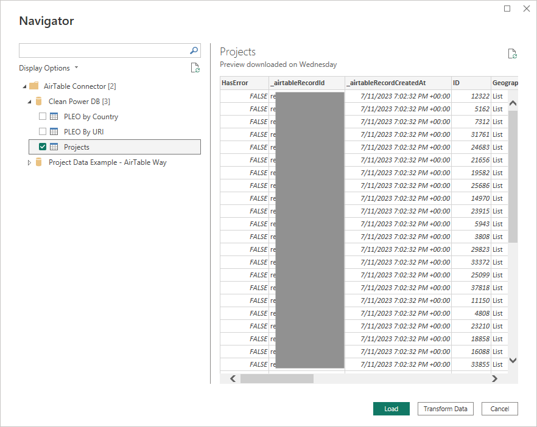

# Airtable-PBI-Connector

An Airtable to Power BI connector. Built using the Visual Studio Code [PowerQuerySDK](https://aka.ms/powerquerysdk) using the Airtable [APIs](https://support.airtable.com/docs/api). 

# Build 

* Download & Install Visual Studio Code
* Download & Install the [PowerQuerySDK](https://aka.ms/powerquerysdk) (note, the SDK only supports Windows at the time of writing)
* Clone this project and open in Visual Studio Code
* Open the file AirTableConnector.query.pq 
* [Evaluate](https://learn.microsoft.com/en-us/power-query/power-query-sdk-vs-code#evaluate-a-query-and-the-results-panel) the file which will build the connector and place a .mez file in the bin directory

# Testing

* Use the Set Credential option in the SDK to configure your Personal Access Token for Airtable. The token *must* have `schema.bases:read` and `data.records:read` permissions. (Write permission is not required)
* Evaluate the AirTableConnector.query.pq file

# Installation

* Copy the .mez file to `[Documents]\Microsoft Power BI Desktop\Custom Connectors`. (See SDK [docs](https://learn.microsoft.com/en-us/power-query/install-sdk#build-and-deploy) for more information)
* If the connector installed correctly, you'll see "Airtable Connector (Beta)" in the Get Data dialog

Once connected, the connector will use the Airtable APIs to show all bases that the token has schema.bases:read permissions to. Click on the bases to choose the tables to load:

# Limitations

* Like all custom connectors that are not certified, the connector does not support refresh within the online PowerBI service.
* However, reports built in the desktop using the connector can be published to the service.
* In principal the connector will deploy within an on premise data gateway to support online refresh, however this has not been tested.
